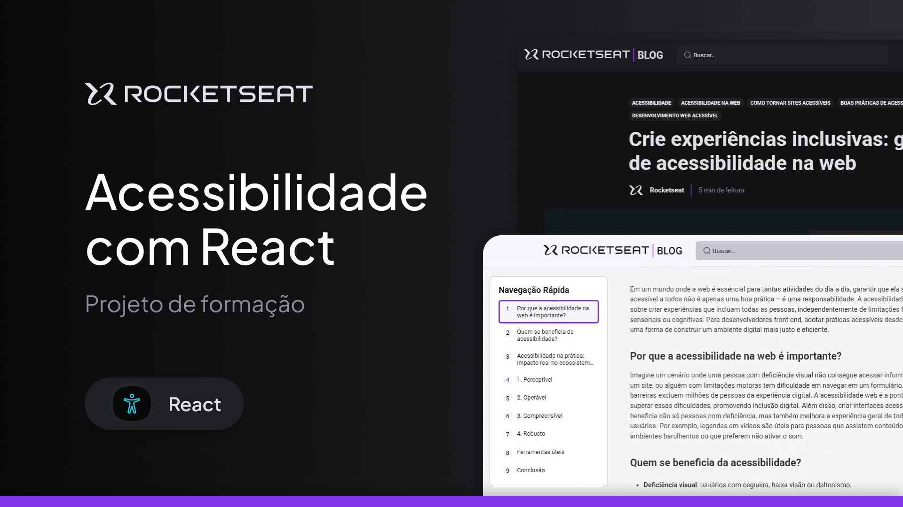
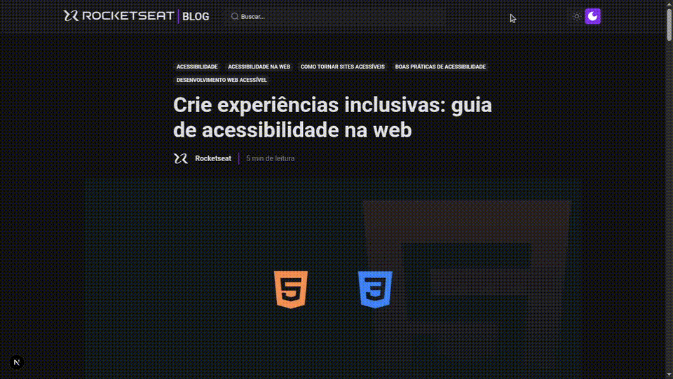

<h1 align="center">Acessibilidade com React</h1>

<p align="center">
  
</p>

> Clone de uma página de blog focado na implementação prática de padrões de Acessibilidade (A11y) e navegação via teclado no React.

<p align="center">
  
</p>

## 🚀 Funcionalidades

- ♿ **Foco em Acessibilidade (A11y):** Implementação de padrões WAI-ARIA e testes de acessibilidade em tempo de desenvolvimento.
- 🔍 **Busca em Modal com Focus Trap:** Botão no cabeçalho com aparência de input que abre uma modal de pesquisa totalmente acessível via Radix UI.
- 🌓 **Tema Claro/Escuro:** Botão de alternância com design visual em estilo radio/switch para troca de tema.
- 📍 **Índice Interativo (Scrollspy):** Menu lateral de atalhos para os títulos `<h2>` e `<h3>` da postagem, com destaque visual e navegação fluida conforme o scroll da página.
- 📱 **Layout Responsivo:** Adaptação completa para diferentes tamanhos de tela.

## 🛠️ Tecnologias e Ferramentas

- [Next.js 16](https://nextjs.org) - Framework React para renderização e rotas
- [React 18](https://react.dev) - Biblioteca para construção de interfaces
- [Radix UI Dialog](https://www.radix-ui.com/primitives/docs/components/dialog) - Primitiva acessível para gerenciamento de modais e retenção de foco (Focus Trap)
- [@axe-core/react](https://github.com/dequelabs/axe-core-npm/tree/develop/packages/react) - Testes automatizados de acessibilidade no console durante o desenvolvimento
- [TypeScript](https://www.typescriptlang.org) - Tipagem estática para JavaScript

## 🚀 Como Executar o Projeto

### Pré-requisitos

Antes de começar, certifique-se de ter instalado em sua máquina:
* [Node.js](https://nodejs.org/)
* [PNPM](https://pnpm.io/) (ou seu gerenciador de pacotes preferido)

### Passo a Passo

1. **Clone o repositório:**
  ```bash
    git clone https://github.com/BrunoBecoski/a11y-app
    cd a11y-app
  ```
2.  **Instale as dependências:**
  ```bash
    pnpm install
  ```

3.  **Inicie o servidor de desenvolvimento:**
  ```bash
    pnpm dev
  ```

Acesse http://localhost:3000 no seu navegador para ver a aplicação rodando.

## ♿ Recursos de Acessibilidade Aprendidos e Aplicados
Este projeto foi construído com o objetivo de praticar e validar conceitos de acessibilidade web:

- **Gerenciamento Acessível de Modais (Radix Primitives)**:

  - Aplicação de Focus Trap na modal de busca (retenção do foco do teclado dentro da janela aberta).

  - Fechamento intuitivo com a tecla `Escape` e restauração automática do foco ao botão de origem.

- **Auditoria de A11y em Tempo Real**:

  - Integração do `@axe-core/react` para apontar automaticamente alertas de contraste, marcação semântica e atributos ARIA diretamente no console durante o desenvolvimento.

- **Scrollspy Acessível**:

  - Destaque nos links do sumário acompanhando a rolagem dos títulos `<h2>` e `<h3>` na tela para facilitar a leitura e navegação rápida.
